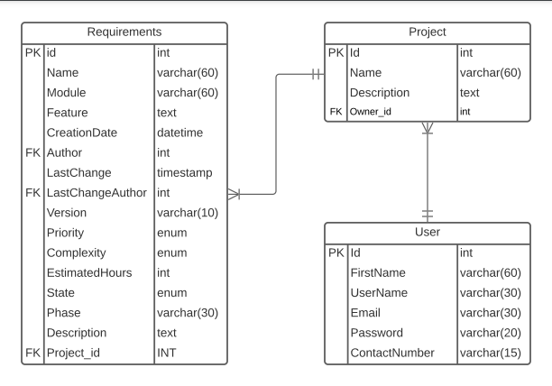

# Vulcano

Vulcano is a project management system focused on software engineering practices and methods.

## Database Diagram

## Habbib project pull request process

* **main:** production
* **features/*:** created from develop branch
* **hotfix/*:** created from master branch for emergency corrections
* **develop:** branch for changes that must be tested before pushed to master

## Authors

* **Arthur M P Camargo** - (https://github.com/arthurmpc)
* **Wallace M M Pontes** - (https://github.com/Wallacemmp)

